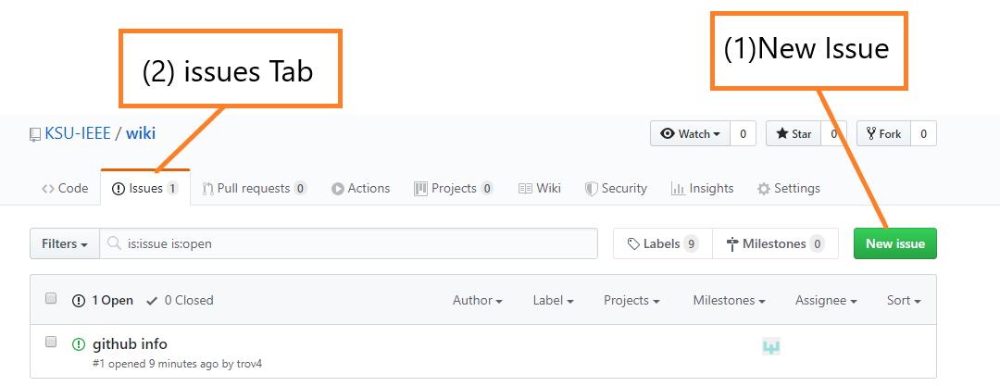
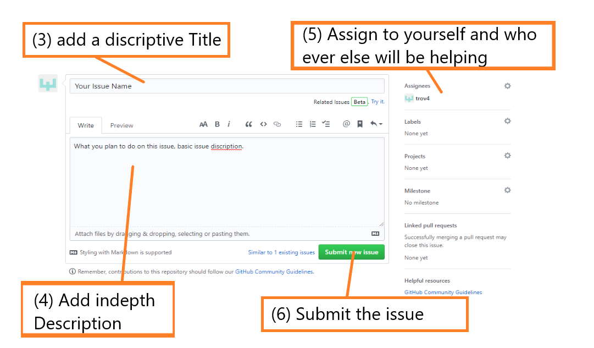
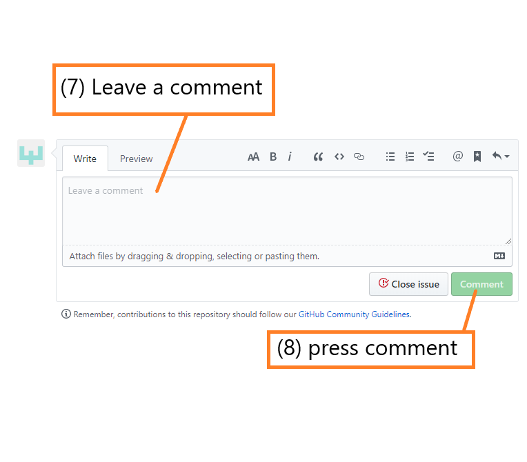
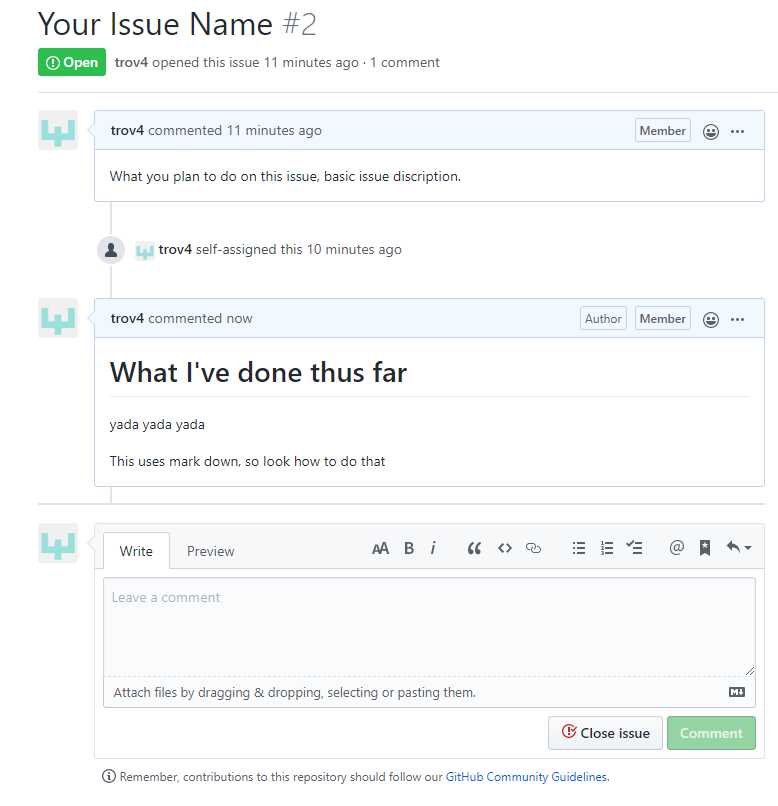

# GitHub Information  
This page holds the information on how to operate on Github. In the past we've been crushed for time, so we've branched when we've needed to without any real reguard for how to do it right. This page hopes to create a solid understanding for everybody to operate with adding code.  
# Issues and Branching 
## Creating an Issue  
We are going to start wit how to open an issue. We will be using issues to better track who is in charge of a task.  
  
In this picture, we see the image screen. To open any new issue, hit the new issue button--number 1.  

  
In this picture, you see the screen you will see when you make a new issue. Follow the numbers, by first adding a title, then the description. This usually helps you organize your thoughts betters  
Then Assign this yourself and anybody else that will be helping you on it.  
Finally submit the issue.  

## Branching  
Know that we have created our issue, we will need a branch to work on the issue. from the terminal, run the command:  
```
$ git branch <name of branch>
$ git checkout <name of branch>
```  
If you are using the GUI, follow the instructions [here](https://www.attosol.com/create-and-merge-branches-using-github-desktop-client/)  

**NAME YOUR BRANCH CORRECTLY**.  The naming system we will be following is the following: `<the number of your issue>-<the name of your issue>`. For the name of your issue, use '-' for spaces. For example. I opened issue number 2 title "Your Issue Name". So when I branch, I will run `git branch 2-Your-Issue-Name` if I wanted to work on that branch.  

## Commenting on your issue  
To keep better information on our code, we will be adding comments on our issues. Because the branches correspond to the issue, we will have an easier time following the code.   
  
Above shows a comment box, you will want to add in depth descriptions a long the way of writing, be sure to hit comment at the end!  

When you've commented, you'll see this:  
  
This shows a clear timeline of the work you will be doing. Comment often to ensure readability.  

## Merging into master
